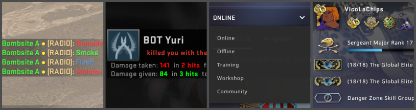

# CSGO-Custom-Text-Mod

[](https://opensource.org/licenses/MIT) [](https://www.python.org/)

Create custom colorful messages & infos for CSGO.



This is a fork from the [Text Color Mod](https://maximhere.me/customization/) from [Bananagaming](https://www.youtube.com/c/BananaGaming/).

The main purpose of this project is to programmatically build the language file for a specific language because non-english ones are annoying to make by hand.

---

## How does it works

In CSGO, each text is displayed using a pair of key-value. To display a text, the game looks for the value (for example "Offical Matchmaking") associated with a key ("play_setting_online") in the corresponding language file. It is possible to modify this value to render a different text (for example, replace it with only "Matchmaking").

The issue is that only English doesn't need all lines to be in the file. For other languages, you need all lines and their english traduction with it to be in.

---

## How to use ?

First, modify the template `custom.txt` file. I recommended using [Sublime Text](https://www.sublimetext.com/) to see correctly the special characters used for colors in chat.

### Language 
Change the value of the language you want your game to be in by editing the value next to the key "Language". It should be a language which exists in the `csgo\resource` folder and be in lowercase.

### Custom text 
Some pair of key-value are already pre-defined in the file and are directly copied from the Text Color Mod. Change the values to your liking. 
You can look in the `csgo\resource\csgo_<any-language>.txt` to find other text you may want to customise.

### Colors
You can add some colors to the text using either special characters (for text displayed in chat) or the font html tag (for text in the UI).
Looks in `custom.txt` for some examples.

### Build the file
Once your changes are done, save the file and run the python script:

```bash
    python3 build_custom_language_file.py [--csgo_path PATH/TO/CSGO/FOLDER] [--custom_path PATH/TO/CUSTOM/FILE]
```
- `--csgo_path` is the path where CSGO is installed. If not specified, it uses the following path : `C:\Program Files (x86)\Steam\steamapps\common\Counter-Strike Global Offensive`.
- `--custom_path` is the path to the custom file. If not specified, it uses `custom.txt`.

The file will then be saved and copied to the `csgo\resource` folder.

### 🚀 Launch option
Finally, you just need to add the launch option `-language custom` to CSGO on Steam.

Enjoy ! 
